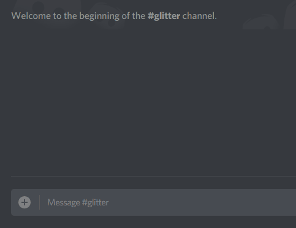

# Discord Glitter
🌠🎇 Animated text messages for your Discord server.



> As one can imagine, this bot doesn't really work in practice since Discord rate-limits requests to its API. That said,
it can yield some nice results for short animations with low frame rate.

# Setup & usage

Add Glitter to your npm project:

```bash
npm install --save discord-glitter
```

Create an `index.js` file with the following contents:

```javascript
const Glitter = require('discord-glitter');

const glitter = new Glitter({
    token: 'your_secret_token',
    //prefix: '@g', /* Custom prefix for bot commands. */
});

glitter.start();
```

Activate Glitter by sending a command `!g` or `!g <some string>` to any channel of your server. You can specify
animation types using `!g|<type>`, the currently supported types are `flash` and `scan`. Example commands:

```
!g
!g Hello World
!g|scan Beep
!g|flash Boop
```

# Adding custom animations:

If you wanna try to add a custom animation, you'll need to clone this repo and  extend
[`lib/frame-generator.js`](./lib/frame-generator.js). You will need to add a new key to `AnimationTypes` object and
handle appropriate logic in `generateFrames(...)`. 

To run the test instance of the bot, copy `test/config.example.json`, rename the copy to `config.json`, input your token
and run `test/standalone.test.js`.
